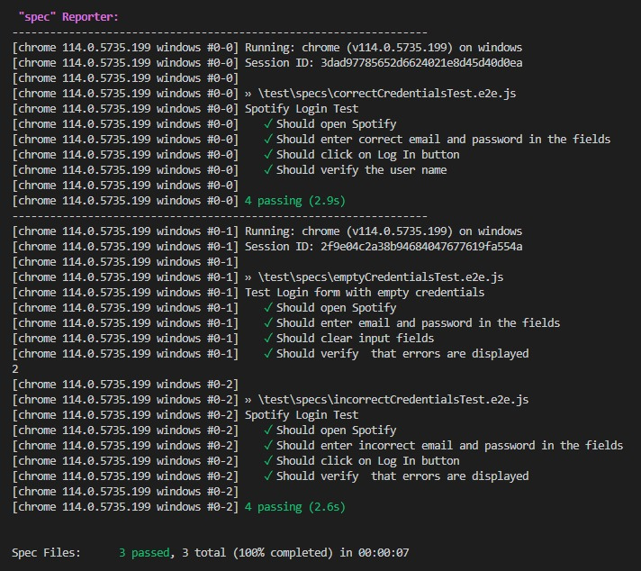

# Spotify Login test

### automated login test for a site Spotify on js using webdriverIO and Mocha

## Test Cases:

1. **Test Login form with empty credentials —** Verify that there will be an error if you enter an empty name and password.

### Steps:

- Type any credentials
- Clear the inputs
- Check the error messages ( "Please enter your Spotify username or email address" and "Please enter your password")

2. **Test Login form with incorrect credentials -** Verify that there will be an error if you enter an incorrect name and password.

### Steps:

- Type any incorrect credentials
- Сlick the LOG IN button
- Check the error message (Incorrect username or password)

3. **Test Login form with correct credentials —** Verify that the correct username is displayed when logging into your account.

### Steps:

- Type the correct credentials
- Сlick LOG IN button
- Check that Name is correct

## How to run the test:

- clone the project to your computer
- install dependencies using the command `npm install`
- run the test using the command `npx wdio`

## test run example

The test uses WebDriver IO, Mocha ("describe it" format) and Page Object Model
